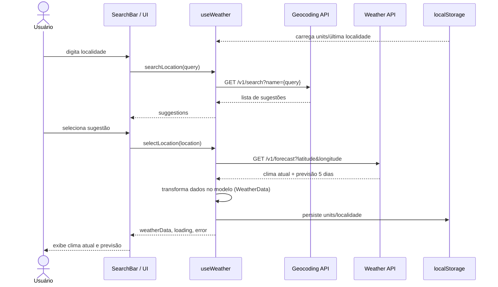

# Weather App Technical Plan

## Arquitetura

A arquitetura será uma aplicação web de cliente único (SPA) com React e Vite.
Os dados meteorológicos são consumidos diretamente do navegador por APIs públicas:
- geocoding API para autocomplete e seleção de localidade;
- weather API para clima atual e previsão de 5 dias.

A aplicação não terá backend customizado no MVP. O frontend gerencia o fluxo de dados, cache local e persistência de preferências.

## Stack

- React 19
- TypeScript 6
- Vite 8
- Tailwind CSS 3
- Vitest para testes unitários
- Testing Library para componentes React
- Playwright para testes E2E
- Biome para lint e formatação

## Estrutura de pastas

- `src/components/` - componentes React isolados e reutilizáveis
- `src/hooks/` - hooks customizados, incluindo `useWeather`
- `src/services/` - integrações com APIs e adaptadores de rede
- `src/types/` - tipos TypeScript compartilhados
- `src/lib/` - utilitários puros e funções de conversão
- `src/styles/` - folhas de estilo Tailwind e temas
- `src/App.tsx` - orquestração da aplicação
- `src/main.tsx` - ponto de entrada do Vite
- `tests/` - testes unitários e E2E complementares

## Modelo de dados

### LocationSuggestion
- `id`: string
- `name`: string
- `region`: string
- `country`: string
- `latitude`: number
- `longitude`: number

### CurrentWeather
- `temperature`: number
- `humidity`: number | null
- `precipitation`: number | null
- `uvIndex`: number | null
- `windSpeed`: number | null
- `windDirection`: string | null
- `condition`: string
- `icon`: string
- `updatedAt`: string

### ForecastDay
- `date`: string
- `minTemperature`: number
- `maxTemperature`: number
- `condition`: string
- `rainProbability`: number | null

### WeatherData
- `location`: LocationSuggestion
- `current`: CurrentWeather
- `forecast`: ForecastDay[]

### Units
- `temperature`: `"celsius" | "fahrenheit"`
- `wind`: `"kmh" | "mph"`

### AppState
- `searchQuery`: string
- `suggestions`: LocationSuggestion[]
- `selectedLocation`: LocationSuggestion | null
- `weatherData`: WeatherData | null
- `units`: Units
- `loading`: boolean
- `error`: string | null
- `status`: `"idle" | "searching" | "loaded" | "error"`

## Fluxo de dados

1. O usuário digita um local no campo de busca.
2. O frontend usa debounce de 300ms e chama o serviço de geocoding.
3. O serviço retorna até 5 sugestões, exibidas ao usuário.
4. O usuário seleciona uma sugestão.
5. O app dispara as chamadas de API para clima atual e previsão de 5 dias.
6. As respostas são transformadas para os tipos do modelo de dados.
7. Os dados são armazenados no estado local e renderizados nos componentes.
8. Preferências de unidade e última localidade podem ser mantidas em `localStorage`.



## Integração com APIs

Fonte de dados: [Open-Meteo](https://open-meteo.com/), que oferece geocoding e previsão do tempo públicos, sem exigir API key.

### Geocoding API
- Fonte: Open-Meteo Geocoding API.
- Endpoint de exemplo:
  ```
  GET https://geocoding-api.open-meteo.com/v1/search?name={query}&count=5&language=pt&format=json
  ```
- Chamadas feitas a partir do serviço em `src/services/weatherService.ts` ou similar.
- Endpoint utilizado para obter sugestões com nome, região e país.
- Limitar retorno a 5 sugestões (`count=5`) e mapear para `LocationSuggestion`.
- Tratamento de erro: se a API falhar, voltar ao estado de erro amigável.

### Weather API
- Fonte: Open-Meteo Forecast API.
- Endpoint de exemplo:
  ```
  GET https://api.open-meteo.com/v1/forecast?latitude={lat}&longitude={lon}&current=temperature_2m,relative_humidity_2m,precipitation,uv_index,wind_speed_10m,wind_direction_10m,weather_code&daily=temperature_2m_max,temperature_2m_min,precipitation_probability_max,weather_code&timezone=auto&forecast_days=5
  ```
- Chamadas para obter clima atual e forecast por coordenadas.
- O parâmetro `timezone=auto` garante que as datas da previsão sejam apresentadas no timezone local da cidade.
- Conversões de unidade podem ser feitas no frontend se a API atender apenas um formato (ex.: `temperature_unit=fahrenheit`, `wind_speed_unit=mph` como parâmetros alternativos).
- Se algum campo não retornar, exibir "dados indisponíveis no momento".

### Geolocation
- Permissão solicitada via browser API.
- Se concedida, obter latitude/longitude e buscar dados automaticamente.
- Se negada, manter busca manual disponível e exibir orientação para habilitar o recurso depois.

## Estratégia de estado

- Usar um hook customizado `useWeather` para orquestrar estado e side effects.
- O estado deve incluir:
  - `searchQuery`
  - `suggestions`
  - `selectedLocation`
  - `weatherData`
  - `units`
  - `loading`
  - `error`
- `units` são persistidos em `localStorage` e recarregados no início.
- O hook deve expor ações claras: `searchLocation`, `selectLocation`, `toggleUnits`, `refreshWeather`, `useGeolocation`.
- Componentes de UI recebem dados por props do hook, mantendo-os testáveis e desacoplados.

## Tratamento de erros

- Erros de rede e de API devem ser capturados em serviços.
- O app deve diferenciar:
  - `no results` (estado vazio)
  - `network error` / `timeout` (mensagem de falha de conexão)
  - `data incompleta` (campos individuais exibem aviso)
- Implementar retries simples com backoff exponencial curto antes de exibir erro final.
- O estado de erro deve ser exibido com mensagem amigável e sugestão de ação, sem travar a interface.
- O `loading` deve ser mostrado enquanto a requisição estiver pendente.

## Estratégia de testes

### Unitários
- Testar utilitários de conversão de unidade e formatação em `src/lib/`.
- Testar serviço de API com mocks de fetch para geocoding e weather.
- Testar o hook `useWeather` isolado com cenários de sucesso e erro.
- Testar componentes de estado (`LoadingState`, `ErrorState`, `EmptyState`) e componentes de exibição de clima.

### E2E
- Cobrir fluxo de busca e seleção de local.
- Verificar alternância de unidades e persistência após reload.
- Testar fallback de erro quando a API retorna falha.
- Validar geolocalização aceita e negada.
- Incluir verificações de acessibilidade básicas no fluxo crítico.

### Métricas e cobertura
- Usar Vitest com coverage para testes unitários.
- Usar Playwright para fluxo de usuário real.
- Definir como objetivo cobertura relevante para `src/services`, `src/hooks` e componentes críticos de exibição.
- Adicionar lints/format no CI via Biome.
